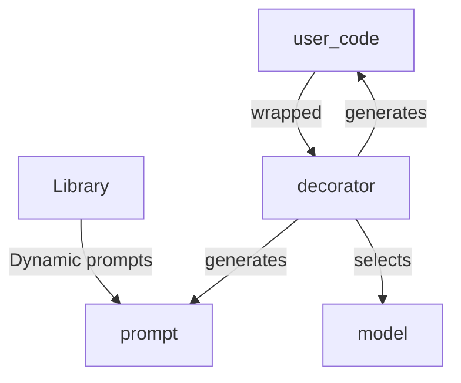

# Plan

```mermaid
graph TD;
    Prompts[Library] --> |Dynamic prompts|prompt;
    
    user_code-->|wrapped| decorator;

    decorator-->|generates|prompt;
    decorator-->|selects|model;
    decorator-->|generates| user_code;

```

prompts
ai 
model
decorators
necromancer
tests
