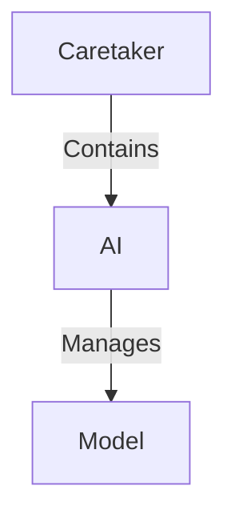

# Refactor

I need to redesign this feature.

[ ] Class model generated via AI
[ ] class ai generated via AI
[ ] Read and fix up ai.py and model.py

# class Model:
- links to a model
- executes a prompt and returns text output 
- Parses and returns a code, adjusts score if needed 
- score adjustment function (if code does not work)
- provides base score based on model capabilities, based on desired task.
- 

# class AI:
- maintains and updates a list of models
- selects a best model for a given task.
- If task fails - retries with same model of different one.
- There are only two tasks at this point :
    - getCode
    - getTestCode

